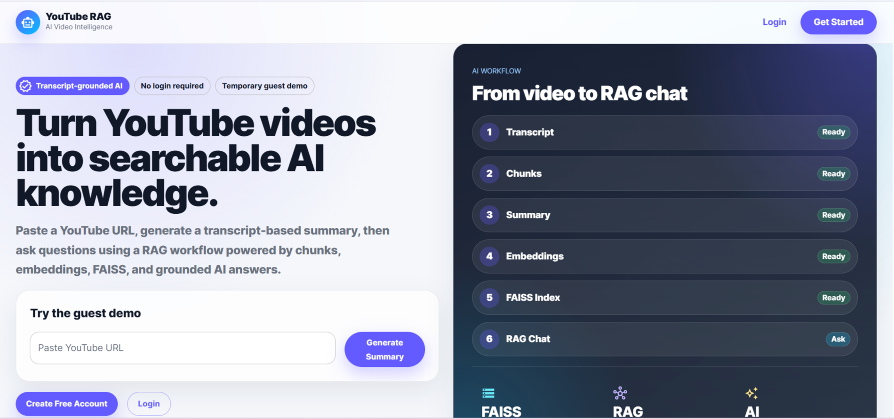
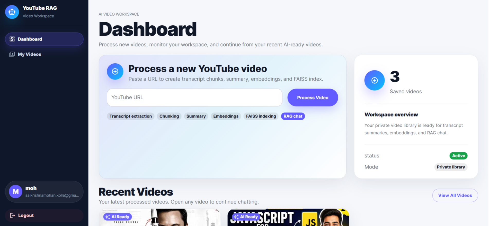
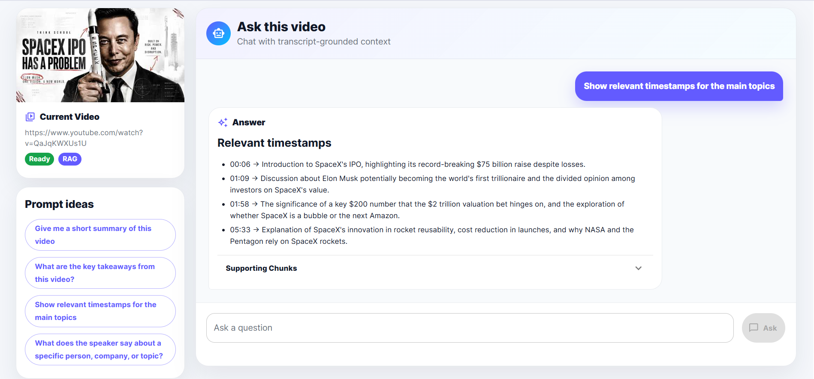

# YouTube RAG Assistant

> Full-stack YouTube intelligence platform built with Retrieval-Augmented Generation (RAG).
> It transforms long-form YouTube videos into searchable knowledge through transcript processing, hybrid retrieval, semantic search, grounded AI generation, and intent-aware question answering.

---

## Table of Contents

- [Overview](#overview)
- [Demo](#demo)
- [Documentation](#documentation)
- [Implemented Features](#implemented-features)
- [Tech Stack](#tech-stack)
- [System Architecture](#system-architecture)
- [RAG Pipeline](#rag-pipeline)
- [Intent Routing](#intent-routing)
- [Retrieval System](#retrieval-system)
- [Summary Generation](#summary-generation)
- [Action / Content Generation](#action--content-generation)
- [Monitoring and Metrics](#monitoring-and-metrics)
- [Evaluation Framework](#evaluation-framework)
- [Installation](#installation)
- [Running Locally](#running-locally)
- [Testing](#testing)
- [Folder Structure](#folder-structure)
- [Roadmap](#roadmap)
- [Author](#author)

---

## Overview

YouTube RAG Assistant transforms long-form YouTube videos into searchable knowledge using transcript processing, hybrid retrieval, intent-aware routing, and grounded AI generation.

The system consists of three main services:

1. **Frontend** — Built with React for guest, user, and admin workflows
2. **Backend API** — Built with Node.js and Express.js for RAG orchestration and business logic
3. **Embedding Service** — Built with FastAPI and FAISS for semantic retrieval

---

## Demo

### Core Workflows

- Guest video summarization
- Authenticated video processing and RAG Q&A
- AI-powered content generation (notes, posts, blogs)
- Admin monitoring dashboard
- Evaluation and metrics dashboard

## Screenshots

### Landing Page



### User Dashboard



### Video Chat Interface



---

## Documentation

Detailed technical documentation is available in the `docs/` folder:

- `docs/ARCHITECTURE.md` — Full system architecture and design decisions
- `docs/API.md` — Complete API documentation
- `docs/EVALUATION.md` — RAG evaluation methodology and benchmarks
- `docs/MONITORING.md` — Metrics, logging, and observability
- `docs/ENVIRONMENT.md` — Complete environment configuration

---

## Implemented Features

### Authentication & Access

- Local email/password authentication with hashed credentials
- Email verification workflow
- Google OAuth login
- JWT-based session management
- Role-based access control for `user` and `admin` workflows

### Video Processing Pipeline

- YouTube URL parsing and transcript extraction via Supadata
- Timestamp-aware transcript chunking with overlap
- Transcript persistence in MongoDB
- Background summary generation and embedding indexing
- Processing status tracking and cleanup workflows

### RAG Question Answering

- Intent-aware query routing
- Video, topic, and entity overview responses
- Timestamp-based answers
- Grounded transcript-only question answering
- Chat history persistence with supporting chunk references

### Hybrid Retrieval

- Semantic vector search using FAISS
- LLM-assisted query expansion
- Keyword-based transcript retrieval
- Entity-aware and topic-aware retrieval
- Hybrid ranking with automatic re-indexing fallback

### AI Content Generation

Generate structured outputs from video content, including:

- Detailed notes and study notes
- LinkedIn posts and tweet threads
- Blog outlines
- Action items and key takeaways

### Monitoring & Reliability

- Structured JSON logging and request metrics
- API latency and retrieval performance monitoring
- LLM and embedding service health checks
- Admin dashboard for metrics, health, and system inspection

### Evaluation Framework

- Automated RAG benchmark cases
- Relevance, groundedness, and completeness scoring
- Hallucination risk detection
- Latency tracking and regression monitoring

---

## Tech Stack

### Frontend

| Area               | Technology                                      |
| ------------------ | ----------------------------------------------- |
| Framework          | React                                           |
| Build Tool         | Vite                                            |
| UI                 | Material UI                                     |
| Routing            | React Router                                    |
| HTTP Client        | Axios                                           |
| Markdown Rendering | react-markdown                                  |
| Tests              | Vitest / React Testing Library style test setup |

### Backend

| Area            | Technology                              |
| --------------- | --------------------------------------- |
| Runtime         | Node.js                                 |
| API Framework   | Express.js                              |
| Database        | MongoDB                                 |
| ODM             | Mongoose                                |
| Auth            | JWT, bcryptjs, Google OAuth             |
| Security / HTTP | Helmet, CORS, Morgan                    |
| LLM Providers   | OpenAI Responses API, Ollama            |
| Email           | Brevo SMTP API integration through HTTP |
| Tests           | Jest, Supertest                         |

### Python Embedding Service

| Area          | Technology                      |
| ------------- | ------------------------------- |
| API Framework | FastAPI                         |
| Server        | Uvicorn                         |
| Embeddings    | OpenAI `text-embedding-3-small` |
| Vector Search | FAISS CPU                       |
| Numerics      | NumPy                           |
| Validation    | Pydantic                        |
| Tests         | Pytest                          |

---

## System Architecture

```text id="th8eza"
User / Guest / Admin
        |
        v
React + Vite Frontend
        |
        v
Node.js / Express Backend API
        |
        +--> Authentication & Authorization
        |       +--> Local / Google OAuth
        |       +--> JWT Protection
        |       +--> Role-Based Access
        |
        +--> Video Processing Pipeline
        |       +--> YouTube Transcript Fetch
        |       +--> Chunk Generation
        |       +--> Background Processing
        |
        +--> RAG Orchestration
        |       +--> Intent Routing
        |       +--> Hybrid Retrieval
        |       +--> Prompt Engineering
        |       +--> LLM Generation
        |
        +--> Admin / Metrics / Health / Evaluation
        |
        v
MongoDB
        |
        +--> Users
        +--> Videos
        +--> Transcript Chunks
        +--> Chat History
        +--> Metric Logs
        +--> Eval Reports
        |
        v
Python FastAPI Embedding Service
        |
        +--> OpenAI Embeddings
        +--> FAISS Indexing
        +--> Semantic Search
```

The system is built as a multi-service architecture with three core layers:

### Frontend Layer

The React frontend provides separate interfaces for public users, authenticated users, and administrators.

Core UI areas include:

- **Public Interface** — Guest summarization, login, and registration
- **User Dashboard** — Video management and chat workflows
- **Video Chat Interface** — Interactive RAG-based Q&A
- **Admin Dashboard** — Metrics, health checks, and evaluation tools

The frontend uses protected routes and role-based access control to isolate user and admin workflows.

### Backend Layer

The Node.js + Express.js backend acts as the orchestration layer for authentication, video processing, retrieval, prompt construction, AI response generation, and system observability.

### Embedding Layer

A dedicated Python microservice built with FastAPI handles embedding generation, vector indexing, and semantic retrieval using FAISS.

Each processed video maintains its own vector index, enabling efficient video-level semantic search. Embeddings are normalized so similarity search behaves like cosine similarity, improving retrieval quality.

This architecture separates application logic, AI orchestration, and vector search workloads, improving modularity, scalability, and maintainability.

---

## RAG Pipeline

The platform uses an intent-aware Retrieval-Augmented Generation (RAG) pipeline to generate grounded responses from video transcripts.

```text
User Question
    |
    v
Question Router
    |
    +--> VIDEO_OVERVIEW      -> Summary-based answer
    +--> ENTITY_OVERVIEW     -> Entity-focused answer
    +--> TOPIC_OVERVIEW      -> Topic-focused answer
    +--> TIMESTAMP_QUERY     -> Timestamp retrieval
    +--> ACTION_EXTRACTION   -> Content generation workflow
    +--> SPECIFIC_QA         -> Hybrid retrieval + grounded answer generation
```

The pipeline ensures responses are generated using transcript-grounded context rather than generic model knowledge, reducing hallucinations and improving answer reliability.

---

## Intent Routing

The application uses a rule-based intent router to classify user queries and select the most appropriate retrieval and response strategy before RAG execution.

### Supported Intents

| Intent              | Purpose                                                                           |
| ------------------- | --------------------------------------------------------------------------------- |
| `VIDEO_OVERVIEW`    | Provides a high-level summary and key takeaways of the video                      |
| `ENTITY_OVERVIEW`   | Explains what a specific person or entity discussed                               |
| `TOPIC_OVERVIEW`    | Summarizes major points related to a specific topic                               |
| `SPECIFIC_QA`       | Handles detailed grounded question answering using transcript retrieval           |
| `ACTION_EXTRACTION` | Generates structured outputs such as notes, blog outlines, posts, or action items |
| `TIMESTAMP_QUERY`   | Returns when a topic or discussion occurred in the video                          |

This routing layer improves answer quality by matching each query with the most relevant retrieval strategy.

---

## Retrieval System

The application uses a hybrid retrieval pipeline to fetch the most relevant transcript context before answer generation.

### Retrieval Components

- **Vector Search** — Uses semantic embeddings and FAISS to retrieve semantically similar transcript chunks
- **Query Expansion** — Uses an LLM to expand queries and improve retrieval recall
- **Keyword Search** — Captures exact phrase matches that semantic search may miss
- **Entity-Aware Retrieval** — Prioritizes chunks mentioning people, companies, products, or organizations
- **Topic-Aware Retrieval** — Retrieves topic-relevant chunks with neighboring context
- **Auto Re-Indexing** — Automatically rebuilds missing or outdated vector indexes
- **Merge and Rank** — Combines retrieval results using hybrid scoring

This hybrid retrieval design improves precision, recall, and grounding quality compared to semantic search alone.

---

## Summary Generation

The platform automatically generates structured summaries after transcript chunking to improve retrieval quality and reduce response latency.

### Summary Pipeline

```text
Transcript Chunks
    ↓
Noise Filtering
    ↓
Section-Level Summaries
    ↓
Final Structured Video Summary
    ↓
Stored for Retrieval
```

Each processed video generates:

- Short video overview
- Detailed summary
- Main topics
- Key takeaways
- Entity-level insights
- Topic-level summaries

These summaries power overview queries, topic exploration, entity explanations, and content generation workflows.

This summary-first design reduces LLM cost and improves response speed for high-level queries.

---

## Action / Content Generation

Beyond question answering, the platform can transform video content into reusable structured outputs using grounded AI generation.

### Supported Output Types

| Output Type      | Description                               |
| ---------------- | ----------------------------------------- |
| `DETAILED_NOTES` | Comprehensive notes covering key concepts |
| `STUDY_NOTES`    | Revision-friendly learning notes          |
| `LINKEDIN_POST`  | Professional social media content         |
| `TWEET_THREAD`   | Multi-post thread summarization           |
| `BLOG_OUTLINE`   | Structured article or blog outline        |
| `ACTION_ITEMS`   | Tasks and actionable recommendations      |
| `KEY_TAKEAWAYS`  | Important insights and conclusions        |
| `GENERIC_NOTES`  | General-purpose summarized notes          |

Generated outputs are grounded using summaries and transcript context to ensure relevance and reduce hallucinations.

This enables users to repurpose long-form video content into practical, shareable formats with minimal manual effort.

---

## Monitoring and Metrics

The platform includes structured monitoring and observability to track system health, performance, and AI quality across the entire RAG pipeline.

### Metrics Tracked

- API request latency and error rates
- Video processing performance
- Embedding generation and vector search health
- Retrieval quality and supporting chunk scores
- LLM response latency and token usage
- Guest session activity
- Evaluation run results

### Monitoring Capabilities

The system captures structured JSON logs for:

- HTTP requests
- Background jobs
- Retrieval pipeline stages
- LLM generation
- Error handling and failures

Metrics can optionally be persisted to MongoDB for historical analysis and dashboard visualization.

This monitoring layer helps identify bottlenecks, detect failures early, and evaluate production RAG performance over time.

---

## Evaluation Framework

The platform includes an automated evaluation framework to measure retrieval quality, answer quality, and end-to-end RAG performance.

### Evaluation Coverage

The system evaluates multiple query types, including:

- Video overview
- Specific question answering
- Topic-based queries
- Entity-based queries
- Timestamp queries
- Action/content generation
- Guest summary and guest Q&A

### Evaluation Metrics

Each evaluation run measures:

- **Relevance** — How well the answer matches the question
- **Groundedness / Faithfulness** — Whether the answer is supported by retrieved transcript context
- **Completeness** — Whether important details are included
- **Latency** — End-to-end response time
- **Hallucination Risk** — Probability of unsupported AI output

Evaluation reports are persisted for performance tracking, regression detection, and benchmarking across model or retrieval changes.

This evaluation layer enables systematic improvement of retrieval precision, answer quality, and production reliability.

---

## Installation

### 1. Clone Repository

```bash id="3w4b4m"
git clone https://github.com/SaiKrishnaMohan053/youtube-rag-assistant.git
cd youtube-rag-assistant
```

Prerequisites:

- Node.js 18+
- Python 3.10+
- MongoDB

### 2. Install Backend Dependencies

```bash id="rppwfk"
npm install
```

### 3. Install Frontend Dependencies

```bash id="s4zmyc"
cd client
npm install
cd ..
```

### 4. Install Python Embedding Service Dependencies

```bash id="4t5m4o"
cd services/embedding-service
python -m venv .venv
```

Activate virtual environment and install dependencies:

**Windows**

```powershell id="5c4y7w"
.\.venv\Scripts\Activate.ps1
pip install -r requirements.txt
```

**macOS / Linux**

```bash id="v8afq2"
source .venv/bin/activate
pip install -r requirements.txt
```

### 5. Environment Setup

Create `.env` files for:

- Backend
- Frontend
- Python embedding service

See `docs/ENVIRONMENT.md` for full environment configuration.

---

## Running Locally

### Start MongoDB

Use local MongoDB:

```bash id="eg28xv"
mongod
```

Or use MongoDB Atlas by updating `MONGODB_URI`.

### Start Python Embedding Service

```bash id="32v0kr"
uvicorn app:app --reload --port 8001
```

### Start Backend API

```bash id="v98yq3"
npm run dev:api
```

Backend runs at:

```text id="b5n6sj"
http://localhost:5000
```

### Start Frontend

```bash id="4gw1p8"
cd client
npm run dev
```

Frontend runs at:

```text id="8hwp3r"
http://localhost:5173
```

### Start Full Development Environment

```bash id="u6y0tu"
npm run dev
```

This starts:

- Backend API
- Python embedding service

using `concurrently`.

---

## Testing

The project includes automated test coverage across frontend, backend, and the Python embedding service.

### Backend Tests

```bash id="xv0wwb"
npm test
```

Uses **Jest + Supertest** for:

- Authentication
- API routes
- Retrieval pipeline
- RAG workflows
- Middleware and utilities

### Frontend Tests

```bash id="o2bnmx"
cd client
npm test
```

Uses **Vitest** for:

- UI components
- Routing
- Auth state management
- Page workflows

### Python Service Tests

```bash id="7gjg7q"
pytest services/embedding-service/tests
```

Uses **Pytest** for:

- Embedding generation
- FAISS indexing
- Semantic search validation

---

## Folder Structure

```text
youtube-rag-assistant/
├── client/                     # React frontend
├── src/                        # Node.js backend
│   ├── controllers/
│   ├── models/
│   ├── routes/
│   ├── services/
│   └── utils/
├── services/
│   └── embedding-service/      # FastAPI + FAISS service
├── docs/
├── tests/
└── README.md
```

---

## Roadmap

Possible next improvements based on the current architecture:

- Add streaming LLM responses
- Add multi-video search
- Replace in-process background jobs with a queue system
- Add retry logic for summary and embedding jobs
- Add per-user rate limits
- Add Redis caching
- Add citation highlighting in the frontend
- Add transcript-side highlighting for supporting chunks
- Add production dashboard charts for metrics
- Add cost tracking for LLM and embeddings
- Add persistent guest sessions if needed
- Add role management UI for admins
- Add deployment-specific configs for Render/Railway/Fly.io/AWS

---

## License

ISC

---

## Author

**Sai Krishna Mohan**  
GitHub: [SaiKrishnaMohan053](https://github.com/SaiKrishnaMohan053)
